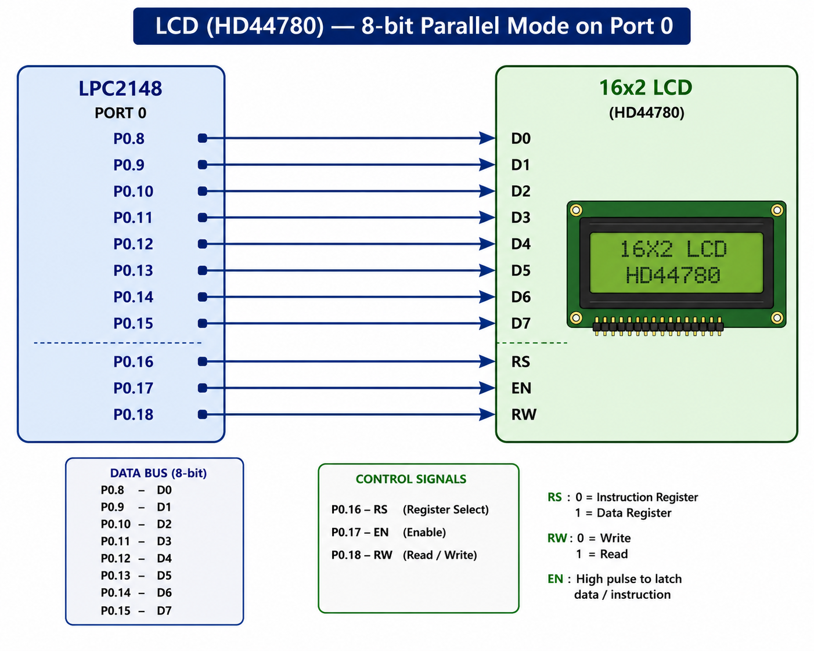
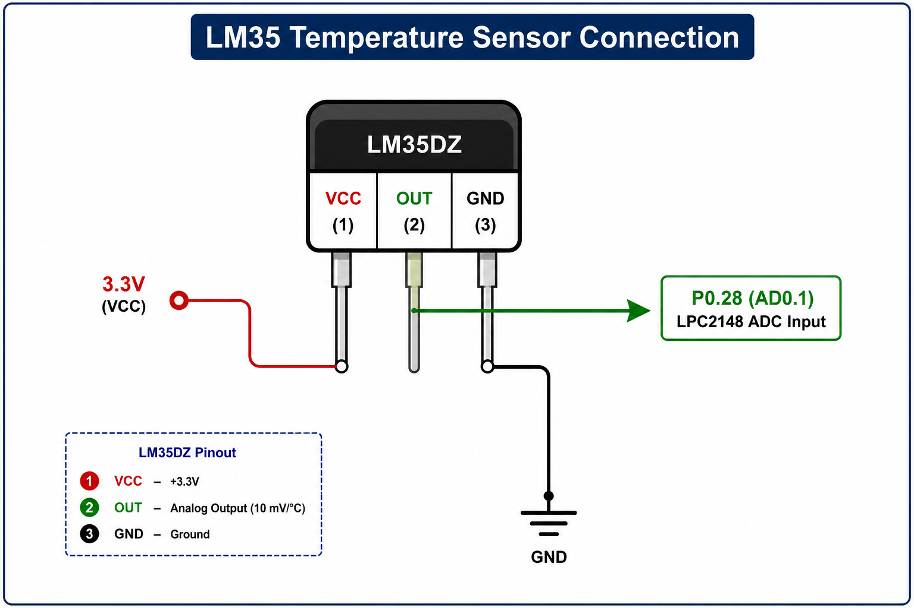
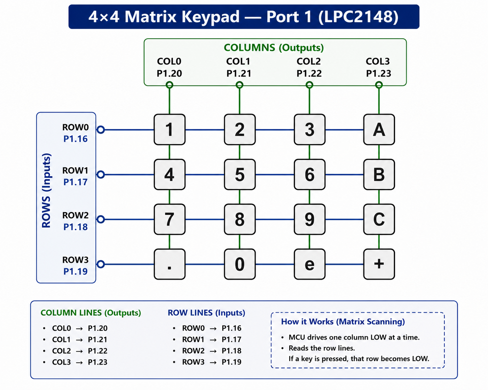
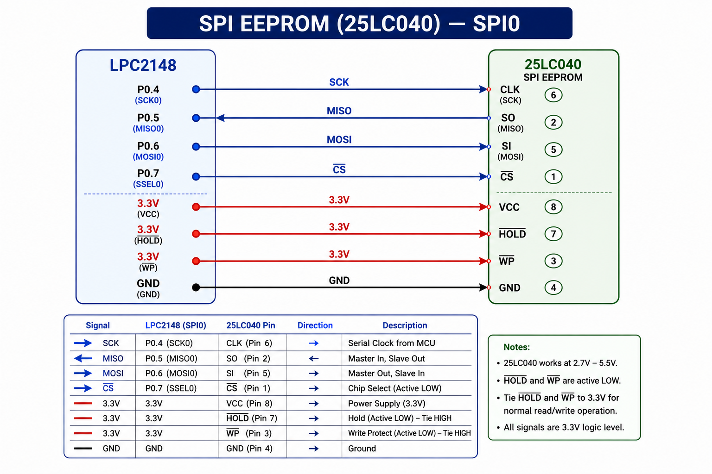
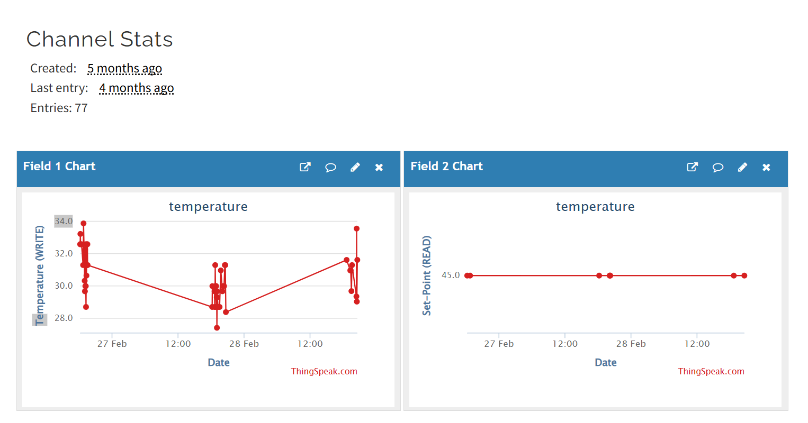

<p align="center">
  
  
  
  
  
  
</p>

<p align="center">
  
  
  
  <a href="https://github.com/ayan2362003"></a>
</p>

<h1 align="center">🌡️ IoT Dual Mode Temperature Set Point Controller</h1>

<p align="center">
  <strong>Real-time IoT-enabled temperature monitoring & set-point control</strong><br/>
  <em>Built on ARM7 (NXP LPC2148) • LM35 Sensor • ESP-01 Wi-Fi • ThingSpeak Cloud Dashboard</em>
</p>

<p align="center">
  <sub>🌡️&nbsp;±0.5°C Accuracy&nbsp;&nbsp;·&nbsp;&nbsp;⌨️&nbsp;Local Keypad Override&nbsp;&nbsp;·&nbsp;&nbsp;☁️&nbsp;3-min Cloud Sync&nbsp;&nbsp;·&nbsp;&nbsp;💾&nbsp;Zero Data Loss on Power Cut</sub>
</p>

---

## 📌 Table of Contents

| # | Section | Description |
|---|---------|-------------|
| 1 | [Project Overview](#-project-overview) | What this system does and why |
| 2 | [Features](#-features) | Complete feature list |
| 3 | [Project Images](#-project-images) | Hardware setup & LCD display photos |
| 4 | [Hardware Components](#-hardware-components) | Full Bill of Materials |
| 5 | [Circuit Details & Pin Connections](#-circuit-details--pin-connections) | Pinout, clock, wiring diagrams |
| 6 | [Software Architecture](#-software-architecture) | Code structure & main loop flow |
| 7 | [ThingSpeak IoT Dashboard](#-thingspeak-iot-dashboard) | Cloud data fields & protocol |
| 8 | [System Configuration](#-system-configuration) | Configurable parameters |
| 9 | [Build & Flash Instructions](#-build--flash-instructions) | How to compile and deploy |
| 10 | [Troubleshooting](#-troubleshooting) | Common issues & fixes |
| 11 | [File Structure](#-file-structure) | Source code organization |

---

## 📖 Project Overview

This project is an embedded IoT system built on the **NXP LPC2148 ARM7TDMI-S** microcontroller that continuously monitors ambient temperature and gives the user **two independent ways** to set the alarm threshold — locally at the device, or remotely from anywhere via the cloud.

- 🔘 **Local set-point entry** via the on-board 4×4 matrix keypad, saved instantly to EEPROM
- ☁️ **Remote set-point sync** from the ThingSpeak cloud dashboard, checked every 3 minutes
- 🔔 **Instant buzzer alarm** the moment temperature exceeds the active set point
- 💾 **EEPROM persistence** — the set point survives power cycles, with a safe 30.0 °C default on first boot
- 📶 **Cloud upload** of live temperature readings every 2 minutes for remote monitoring

### 🔧 System Specifications

| Parameter | Specification |
|-----------|---------------|
| **Microcontroller** | NXP LPC2148 — ARM7TDMI-S core, 60 MHz, 512 KB Flash, 40 KB SRAM |
| **Temperature Sensor** | LM35 — Range: 0–100 °C, Accuracy: ±0.5 °C, 10 mV/°C linear output |
| **Display** | 16×2 Character LCD — HD44780 controller, 8-bit parallel interface |
| **Wi-Fi Module** | ESP-01 (ESP8266) — 802.11 b/g/n, UART AT-command interface, 9600 baud |
| **Non-volatile Storage** | SPI EEPROM (25LC040) — 512 bytes, 100 kHz SPI |
| **User Input** | 4×4 Matrix Keypad (16 keys) + 1 External Interrupt Push Button |
| **Cloud Platform** | ThingSpeak IoT — 2-field channel, upload every 120 s / sync every 180 s |
| **Alert System** | Active buzzer — over-temperature threshold alarm |
| **Development IDE** | Keil µVision (v4/v5) — ARM MDK toolchain |
| **System Clock** | 60 MHz (PLL: 12 MHz × 5), Peripheral clock: 15 MHz (CCLK/4) |

---

## ✨ Features

### 🌡️ Core Monitoring
| Feature | Description |
|---------|-------------|
| Real-time ADC sensing | LM35 analog output → 10-bit ADC → °C conversion, sampled continuously |
| Live LCD dashboard | Simultaneous temperature + set-point display on 16×2 HD44780, refreshed every 1 s |

### ⌨️ Local & Remote Control
| Feature | Description |
|---------|-------------|
| Local keypad entry | 4×4 matrix with decimal support, backspace (`+`), confirm (`e`) |
| Interrupt-driven trigger | EINT0 hardware interrupt instantly opens keypad-entry mode |
| Remote override | A set-point change on the cloud dashboard applies automatically within one sync cycle |

### ☁️ IoT & Cloud
| Feature | Description |
|---------|-------------|
| Temperature upload | Pushed to ThingSpeak Field 1 every 120 seconds |
| Set-point sync (download) | Pulled from ThingSpeak Field 2 every 180 seconds |
| Set-point upload | Pushed to ThingSpeak Field 2 on demand whenever changed locally |

### 💾 Persistence & Reliability
| Feature | Description |
|---------|-------------|
| EEPROM persistence | Set point saved byte-by-byte, survives power cycles |
| Safe default | Falls back to `30.0 °C` if EEPROM is blank or corrupt |
| Over-temp alarm | Buzzer activates immediately when `temperature > set_point` |

---

## 📸 Project Images

### 1. Full Hardware Setup

> *Complete hardware assembly showing the LPC2148 board with all peripheral modules connected — LM35 sensor, ESP-01 Wi-Fi module, 16×2 LCD, 4×4 keypad, buzzer, and SPI EEPROM.*


---

### 2. LCD Display Output

> *System running in monitoring mode — LCD shows live temperature (Line 1) and active set point (Line 2) in real time.*


---

## 🔧 Hardware Components

### Bill of Materials (BOM)

| # | Component | Model / Specification | Interface | Qty |
|:-:|-----------|----------------------|-----------|:---:|
| 1 | **Microcontroller** | NXP LPC2148 (ARM7TDMI-S, 60 MHz, 512 KB Flash, 40 KB SRAM) | — | 1 |
| 2 | **Temperature Sensor** | LM35 (10 mV/°C, 0–100 °C, ±0.5 °C accuracy) | ADC Ch.1 | 1 |
| 3 | **Character LCD** | 16×2 HD44780-compatible (8-bit parallel mode) | 8-bit GPIO | 1 |
| 4 | **Wi-Fi Module** | ESP-01 (ESP8266, 802.11 b/g/n, AT-command firmware) | UART0 @ 9600 | 1 |
| 5 | **EEPROM** | 25LC040 SPI EEPROM (512 bytes) | SPI0 @ 100 kHz | 1 |
| 6 | **Matrix Keypad** | 4×4 membrane keypad | GPIO (Port 1) | 1 |
| 7 | **Buzzer** | 3.3V active buzzer + NPN driver transistor | GPIO (P0.23) | 1 |
| 8 | **Set-Point Button** | Tactile push button (momentary, NO) | EINT0 (P0.3) | 1 |
| 9 | **Crystal Oscillator** | 12 MHz HC-49S quartz crystal | XTAL1/XTAL2 | 1 |
| 10 | **Contrast Pot** | 10 kΩ trimmer potentiometer (LCD V0 adjustment) | — | 1 |
| 11 | **Backlight Resistor** | 100 Ω (LCD LED+ current limit) | — | 1 |

---

## ⚡ Circuit Details & Pin Connections

<details>
<summary><strong>📍 Complete Pin Mapping — LPC2148</strong> (click to expand)</summary>

#### Port 0 — Main Peripheral Bus

| Pin | Alternate Function | Signal | Connected To | Direction | Notes |
|:---:|:------------------:|--------|-------------|:---------:|-------|
| P0.0 | TXD0 | UART0 TX | ESP-01 RX | OUT | 9600 baud, AT commands |
| P0.1 | RXD0 | UART0 RX | ESP-01 TX | IN | Interrupt-driven RX (VIC Ch.6) |
| P0.3 | EINT0 | Set-point IRQ | Push button → GND | IN | Edge-triggered, opens keypad mode |
| P0.4 | SCK0 | SPI Clock | EEPROM CLK | OUT | 100 kHz, Mode 0 |
| P0.5 | MISO0 | SPI Data In | EEPROM SO | IN | — |
| P0.6 | MOSI0 | SPI Data Out | EEPROM SI | OUT | — |
| P0.7 | GPIO | SPI Chip Select | EEPROM CS̄ | OUT | Active-LOW |
| P0.8–P0.15 | — | LCD D0–D7 | LCD data bus | OUT | 8-bit parallel |
| P0.16 | — | LCD RS | LCD pin 4 | OUT | 0 = Command, 1 = Data |
| P0.17 | — | LCD EN | LCD pin 6 | OUT | Falling-edge latch |
| P0.18 | — | LCD RW | Hardwired GND | OUT | Write-only |
| P0.23 | — | Buzzer | Buzzer driver | OUT | Active-HIGH |
| P0.28 | AD0.1 | LM35 analog in | LM35 OUT | IN | ADC Channel 1 |

#### Port 1 — 4×4 Keypad Matrix

| Pin | Function | Direction | Notes |
|:---:|----------|:---------:|-------|
| P1.16 | Row 0 | OUT | Active-LOW scan |
| P1.17 | Row 1 | OUT | Active-LOW scan |
| P1.18 | Row 2 | OUT | Active-LOW scan |
| P1.19 | Row 3 | OUT | Active-LOW scan |
| P1.20 | Column 0 | IN | Internal pull-up enabled |
| P1.21 | Column 1 | IN | Internal pull-up enabled |
| P1.22 | Column 2 | IN | Internal pull-up enabled |
| P1.23 | Column 3 | IN | Internal pull-up enabled |

### Interrupt Map

| Interrupt | Source | Pin | Trigger | Purpose |
|-----------|--------|-----|---------|---------|
| **EINT0** | Set-point push button | P0.3 | Edge-triggered (`EXTMODE=1`) | Sets `flag=1` → main loop enters keypad input mode (VIC Ch.15) |

</details>

---

### 🖼️ Circuit Wiring Diagrams

#### LCD (HD44780) — 8-bit Parallel



Contrast is set via the 10 kΩ potentiometer on V0; backlight runs through a 100 Ω resistor.

#### LM35 Temperature Sensor → ADC Channel 1



> **Conversion formula:**
> ```
> Voltage (V)       = (ADC_Result / 1023) × 3.3V
> Temperature (°C)  = Voltage × 100
> Temperature (°F)  = (°C × 1.8) + 32
> ```
ADC runs at 3 MHz, 10-bit resolution, software-triggered single conversion.

#### 4×4 Matrix Keypad



Special keys: `0`–`9` and `.` for digit entry, `e` = confirm, `+` = backspace.

#### ESP-01 Wi-Fi Module


UART runs at 9600 8N1 with interrupt-driven RX (200-byte circular buffer). **ESP-01 VCC and CH_PD must be 3.3V — never 5V.**

#### SPI EEPROM (25LC040)



SPI runs at 100 kHz, Mode 0, MSB-first. Opcodes used: `WREN 0x06` · `WRDI 0x04` · `READ 0x03` · `WRITE 0x02`.

---

## 🏗️ Software Architecture

The firmware follows a **modular driver architecture** — each peripheral has its own `.c`/`.h` pair with a clean public API:


| Module | Files | Responsibility |
|--------|-------|---------------|
| **Application** | `main.c` | Main loop, set-point comparison, buzzer control, upload/sync timing |
| **WiFi/Cloud** | `esp01.c` / `.h` | AT command sequences: connect AP, send/read ThingSpeak data |
| **Display** | `lcd.c` / `.h` / `lcd_defines.h` | HD44780 init, command/data write, string/float display |
| **Keypad** | `kpm.c` / `.h` / `kpm_defines.h` | Row-column scanning, key decoding, debounce |
| **ADC** | `adc.c` / `.h` / `adc_defines.h` | ADC init, single-channel read, voltage conversion |
| **EEPROM** | `spi_eeprom.c` / `.h` / `spi_eeprom_defines.h` | Byte-level read/write with WREN/READ/WRITE opcodes |
| **SPI Bus** | `spi.c` / `.h` / `spi_defines.h` | SPI0 master init, clock config |
| **UART** | `uart0.c` / `.h` / `uart0_defines.h` | TX char/string/float, interrupt-driven RX buffer |
| **RTC** | `rtc.c` / `.h` / `rtc_defines.h` | On-chip RTC initialization, time set |
| **Delay** | `delay.c` / `.h` | Blocking millisecond and second delays |
| **Interrupt** | `eint0_irq_test.c` | EINT0 ISR — sets `flag=1` for keypad mode |
| **Pin Config** | `pin_connect_block.c` / `.h` | PINSEL register configuration utility |

### Main Loop Flow


| Event | Mode | Action |
|-------|------|--------|
| **EINT0 interrupt** (`flag=1`) | 🔘 Local | Keypad input → save to EEPROM → upload to ThingSpeak Field 2 |
| **Every 120 seconds** | ☁️ Upload | Read LM35 → send temperature to ThingSpeak Field 1 |
| **Every 180 seconds** | ☁️ Sync | Read ThingSpeak Field 2 → if changed, update set point + save EEPROM |
| **Every 1 second** | 🔄 Loop | Read LM35 → update LCD → check buzzer |

```
Power ON
   │
   ├─► Initialize all peripherals (LCD, ADC, KPM, SPI, UART0, RTC, EINT0)
   ├─► Connect ESP-01 to Wi-Fi
   ├─► Read set point from EEPROM (default: 30.0°C if empty)
   │
   └─► Loop forever:
          ├─ Read LM35 temperature → update LCD
          ├─ If temperature > set point → Buzzer ON, else OFF
          ├─ Every 120s → Upload temperature to ThingSpeak Field 1
          ├─ Every 180s → Sync set point from ThingSpeak Field 2
          └─ On EINT0  → Enter local set-point mode → confirm with 'e'
                          → save to EEPROM + upload to cloud
```

---

## ☁️ ThingSpeak IoT Dashboard

Data is exchanged with **ThingSpeak** via HTTP GET requests through the ESP-01 Wi-Fi module. ThingSpeak's free tier requires ≥15 s between channel updates.



### Channel Field Mapping

| Field | Data Type | Direction | Interval | Description |
|:-----:|-----------|-----------|----------|-------------|
| `field1` | Temperature (°C) | Upload | Every 120 s | Live LM35 reading |
| `field2` | Set Point (°C) | Upload + Download | On-demand upload / 180 s sync | Local keypad changes push here; cloud edits sync back |

### HTTP Request Format

```
Upload temperature:
GET /update?api_key=<WRITE_KEY>&field1=<temp>
Host: api.thingspeak.com

Upload set point:
GET /update?api_key=<WRITE_KEY>&field2=<setpoint>
Host: api.thingspeak.com

Sync set point:
GET /channels/<CHANNEL_ID>/feeds/last.json?api_key=<READ_KEY>
Host: api.thingspeak.com
→ Parse JSON response for "field2":"<value>"
```

### ESP-01 AT Command Sequence

```
AT+CIPCLOSE                                    ← Close any stale TCP connection
AT+CIPSTART="TCP","api.thingspeak.com",80      ← Open TCP to ThingSpeak
AT+CIPSEND=<len>                               ← Declare payload length
GET /update?api_key=...&field1=32.5\r\n\r\n    ← HTTP GET request
AT+CIPCLOSE                                    ← Close connection
```

---

## ⚙️ System Configuration

### Application Settings (`main.c`)

| Define | Default | Unit | Description |
|--------|---------|------|-------------|
| `UPLOAD_INTERVAL` | `120` | seconds | Time between temperature cloud uploads |
| `SYNC_INTERVAL` | `180` | seconds | Time between remote set-point sync |
| `DEFAULT_SET_POINT` | `"30.0"` | °C | Fallback set point if EEPROM is empty/corrupt |
| `BUZZER` | `23` | GPIO pin | P0.23 — buzzer output pin |

### Wi-Fi & ThingSpeak Settings (`esp01.c`)

| Parameter | Default | Change Required |
|-----------|---------|------------------|
| Wi-Fi SSID | `"YOUR_WIFI_SSID"` | **Yes** — your network name |
| Wi-Fi Password | `"YOUR_WIFI_PASSWORD"` | **Yes** — your network password |
| ThingSpeak Write API Key | `"YOUR_WRITE_KEY"` | **Yes** — from your ThingSpeak channel |
| ThingSpeak Read API Key | `"YOUR_READ_KEY"` | **Yes** — from your ThingSpeak channel |
| ThingSpeak Channel ID | `"YOUR_CHANNEL_ID"` | **Yes** — your channel number |

> ⚠️ **Security Warning:** Never commit real Wi-Fi credentials or ThingSpeak API keys to a public repo. Move them into a separate `secrets.h` file, add it to `.gitignore`, and regenerate any keys that were ever committed in plain text.

### Hardware Clock Settings

| Define | Value | Derived |
|--------|-------|---------|
| `FOSC` | `12000000` (12 MHz) | Crystal frequency |
| `CCLK` | `FOSC × 5` = 60 MHz | CPU clock (via PLL) |
| `PCLK` | `CCLK / 4` = 15 MHz | Peripheral clock |
| `BAUD` | `9600` | UART baud rate |
| `ADC_CLK` | `3000000` (3 MHz) | ADC conversion clock |
| `SPI_CLK` | `100000` (100 kHz) | SPI bus clock |

---

## 🛠️ Build & Flash Instructions

### Prerequisites

| Tool | Version | Purpose |
|------|---------|---------|
| **Keil µVision** | v4 or v5 (MDK-ARM) | IDE and ARM-CC compiler |
| **Flash Magic** | Latest | UART ISP programming tool |
| **USB-to-Serial** | Any FTDI/CH340/CP2102 | Connect PC to LPC2148 UART0 |
| **Power Supply** | 3.3V regulated | MCU and peripherals |

### Step-by-Step Build & Deploy

```
Step 1: Clone Repository
────────────────────────
    $ git clone https://github.com/ayan2362003/<repo-name>.git
    $ cd <repo-name>

Step 2: Configure Wi-Fi & ThingSpeak Credentials
─────────────────────────────────────────────────
    Open esp01.c and edit:
    #define WIFI_SSID      "YourNetworkName"
    #define WIFI_PASSWORD  "YourPassword"
    #define TS_WRITE_KEY   "YourWriteAPIKey"
    #define TS_READ_KEY    "YourReadAPIKey"

Step 3: Open in Keil µVision
────────────────────────────
    File → Open Project → major.uvproj

Step 4: Build
─────────────
    Press F7 or Project → Build Target
    Output: major.hex (in project directory)
    Expected: "0 Error(s), 0 Warning(s)"

Step 5: Flash via ISP
─────────────────────
    Open Flash Magic:
      Device     : LPC2148
      COM Port   : COMx @ 9600 baud
      Oscillator : 12 MHz
      Hex File   : major.hex
    → Set P0.14 = LOW (ISP mode), press RESET, click "Start"
    → After "Finished", set P0.14 = HIGH and RESET to run
```

---

## 🔍 Troubleshooting

<details>
<summary><strong>Click to expand common issues & fixes</strong></summary>

| Problem | Possible Cause | Solution |
|---------|---------------|----------|
| LCD shows nothing | Contrast not set | Adjust V0 potentiometer |
| LCD shows blocks | Init timing issue | Check `delay_ms()` after `init_lcd()` |
| ESP shows "WIFI FAILED" | Wrong SSID/password | Update credentials in `esp01.c` |
| ESP shows "TCP FAILED" | No internet / ThingSpeak down | Check router, verify API keys |
| "NO DATA" on sync | ThingSpeak Field 2 is empty | Write a value to Field 2 first |
| Buzzer always ON | Set point too low | Enter a higher set point via keypad |
| Buzzer never triggers | LM35 not connected / wrong channel | Check P0.28 wiring, verify ADC Ch.1 |
| EEPROM not saving | CS pin wrong / SPI not init | Verify P0.7 wiring, check `init_spi()` |
| Keypad not responding | Wrong port pins | Verify P1.16–P1.23 connections |
| Set point resets on boot | EEPROM blank (0xFF) | Normal on first boot — enter value via keypad |

</details>

---

## 📁 File Structure

<details>
<summary><strong>Click to expand full source tree</strong></summary>

```
Working_IOT_DUAL_MODE_SET_POINT/
│
├── 📄 README.md                          # This file
├── 🖼️ project/                           # Project images & diagrams
│   ├── full hardware.jpg                 # Complete hardware setup photo
│   ├── tep and se show display.png       # LCD output screenshot
│   ├── LCD.png                           # LCD circuit connection
│   ├── LM35.png                          # LM35 sensor connection
│   ├── Keypad.png                        # Keypad matrix connection
│   ├── ESP-01 Wi-Fi Module.png           # ESP-01 wiring
│   ├── spi-eeprom.png                    # SPI EEPROM connection
│   ├── thingspeak.png                    # ThingSpeak dashboard
│   ├── Module Breakdown.png              # Software architecture diagram
│   ├── Dual Mode Operation Flow.png      # Dual mode flowchart
│   └── Flash to LPC2148.png              # Flashing guide
│
└── IOT_DUAL_MODE_SET_POINT/
    │
    │── ⭐ main.c                          # Main application entry point
    │
    │── 📶 esp01.c / esp01.h               # ESP-01 WiFi AT command driver
    │── 🌡️ adc.c / adc.h                   # ADC initialization & read
    │── 🖥️ lcd.c / lcd.h                   # 16x2 LCD HD44780 driver
    │── ⌨️ kpm.c / kpm.h                    # 4x4 Keypad matrix scanner
    │── 💾 spi_eeprom.c / spi_eeprom.h     # SPI EEPROM byte operations
    │── 🔌 spi.c / spi.h                   # SPI0 master bus driver
    │── 📡 uart0.c / uart0.h               # UART0 TX/RX with ISR
    │── ⏰ rtc.c / rtc.h                    # On-chip RTC driver
    │── ⏱️ delay.c / delay.h                # Blocking delay utilities
    │── ⚡ eint0_irq_test.c                 # EINT0 interrupt handler
    │── 🔧 pin_connect_block.c / .h        # PINSEL register config
    │
    │── 📋 adc_defines.h                   # ADC clock & bit defines
    │── 📋 lcd_defines.h                   # LCD pin & command defines
    │── 📋 kpm_defines.h                   # Keypad row/col pin map
    │── 📋 spi_defines.h                   # SPI clock config
    │── 📋 spi_eeprom_defines.h            # EEPROM opcodes (WREN, READ...)
    │── 📋 uart0_defines.h                 # Baud rate & UART config
    │── 📋 rtc_defines.h                   # RTC configuration
    │── 📋 pin_functions_definition.h      # PINSEL function constants
    │── 📋 types.h                         # Type aliases (u8, u32, f32...)
    │
    │── 🔩 Startup.s                       # ARM7 startup assembly
    │── 🔩 aurdino.c / aurdino.h           # Arduino companion code
    │
    └── 🏗️ major.uvproj                    # Keil µVision project file
        major.hex                          # Compiled firmware binary
```

</details>

---

## 👨‍💻 Author

**Ayan** — Embedded Systems Project

| | |
|---|---|
| **Project** | IoT Dual Mode Temperature Set Point Controller |
| **Platform** | NXP LPC2148 (ARM7TDMI-S) |
| **IDE** | Keil µVision |
| **Cloud** | ThingSpeak IoT Platform |
| **Language** | Embedded C |
| **GitHub** | [github.com/ayan2362003](https://github.com/ayan2362003) |

---

## 📄 License

This project is developed and shared for **educational and academic purposes**. Feel free to use, modify, and share with attribution.

---

<p align="center">
  
  
  
  
</p>

<p align="center">
  <strong>Built with ❤️ on ARM7 by Ayan</strong><br/>
  <sub>⭐ If this project helped you, consider giving it a star!</sub>
</p>
